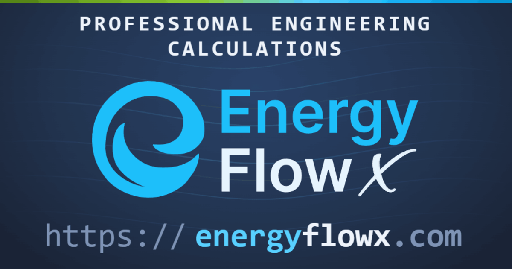

<p align="center">
  <a href="https://energyflowx.com"></a>
</p>

<h1 align="center">EnergyFlowX for Claude</h1>

<p align="center">
  <strong>Validated engineering physics inside your AI assistant.</strong><br>
  Fluid properties, psychrometrics, air handling, pipe and duct sizing and full hydraulic network solving,<br>
  computed from reference equations of state rather than guessed by a language model.
</p>

<p align="center">
  <a href="https://energyflowx.com"></a>
  <a href="https://energyflowx.com/mcp-server"></a>
  <a href="https://energyflowx.com/knowledge"></a>
  <a href="LICENSE"></a>
</p>

---

Ask a chatbot for the density of 30 % propylene glycol at 5 °C and you get a confident number from
nowhere. Ask it with this plugin installed and the number comes from the same engine that powers
[energyflowx.com](https://energyflowx.com), **with the method and its validity range attached**.

This repository is the official, maintained Claude plugin for the EnergyFlowX MCP service. It does two
things at once:

1. **Connects the MCP servers** so Claude can call the calculation tools.
2. **Adds four skills** that teach Claude how to use them well: which inputs matter, what to check
   before quoting a result, and how to present it so an engineer can verify it.

Want the full picture of EnergyFlowX, beyond this plugin? The web platform, its physics, its
validation evidence and every reference behind it are documented in
**[github.com/pjazdzyk/energy-flow-x-docu](https://github.com/pjazdzyk/energy-flow-x-docu)**.

## Contents

- [What it can do](#what-it-can-do), and [every capability in detail](CAPABILITIES.md)
- [Where it fits](#where-it-fits)
- [Quick start](#quick-start)
- [Try it](#try-it)
- [What is inside](#what-is-inside)
- [The API key](#the-api-key)
- [Other clients: Claude Desktop, Cursor, VS Code](#other-clients)
- [Install a single skill](#install-a-single-skill)
- [Update, disable, uninstall](#update-disable-uninstall)
- [Troubleshooting](#troubleshooting)
- [Access terms](#access-terms)
- [Links](#links)
- [Licence](#licence)

## What it can do

Fifteen tools across two MCP servers, grouped here by the question they answer.
[CAPABILITIES.md](CAPABILITIES.md) lists every fluid, block, rule set, fitting and limit in detail.

### Fluid and material properties

Any property at any valid state, from the reference equation of state for that fluid, with the
method and its validity range stated in every answer. Sweeps over up to 5 states in one call
anonymously, 20 with a key.

| Family | Fluids | Method | Access |
| --- | --- | --- | --- |
| Water and steam | liquid water, steam (from any two of p, T, h, s, x) | IAPWS-IF97 | free |
| Air | dry air, humid air (six input pairs, from RH, humidity ratio, wet bulb, dew point and enthalpy) | Lemmon reference EOS, psychrometrics | free |
| Industrial gases | hydrogen, CO₂, ammonia, propane, nitrogen, oxygen, argon, helium, methane, N₂O | multiparameter Helmholtz EOS | free |
| Natural gas | presets or your own composition, plus calorific value and Wobbe index | GERG-2008 (ISO 20765-2), ISO 6976 | free |
| Glycols | ethylene glycol, propylene glycol | Melinder correlations | free |
| Refrigerants | R134a, R1234ze, R1234yf, R32, R125, R454B, R410A, R407C | multiparameter Helmholtz EOS | **API key** |
| Brines | calcium chloride, ethanol, methanol, potassium formate solutions | Melinder correlations | **API key** |
| Solids | ice | | free |

Also saturation (boiling point at a pressure and the reverse, phase densities, latent heat, critical
and triple points) and unit conversion.

### Pipe and duct sizing

- Velocity, pressure drop, Reynolds number, friction factor and flow regime for one pipe or duct.
- **Size selection** against design criteria or your own limits: the smallest size that passes, the
  size below and the limit it breaks, and the size above.
- Real product catalogues: inner bore, wall thickness, SDR and roughness for standard pipes and
  ducts.
- Schedules of up to 20 segments with fittings, judged against a total pressure-drop budget.
- A heat load in place of a flow, for water, glycols, brines and air.

### Air handling (AHU processes)

Heating and cooling coils with condensate and water flow, mixing up to six streams, heat recovery to
EN 16798-3 and EN 308 with frost protection, fans and the heat they add, steam humidification,
air-water contact, dehumidification and desiccant wheels. One block or a chain of up to eight. A
target a step cannot reach is reported as not feasible, never as a clean answer.

### Hydronic MCP: complex hydraulics (API key)

Whole pipe and duct networks built step by step on the server: pressure boundaries, demands, pipes,
fittings and resistances, branched or looped. Water and glycol circuits, compressed air, natural gas,
ventilation ducts, steam mains and refrigerant lines, and several fluids in one design, each solved at
its own temperature. The solver finds every flow and pressure at once, reports velocities (with the
Mach number for a gas) and any node where the fluid condenses, flashes or boils, then says what to
check before trusting the numbers. Pumps, compressors with heat recovery, heaters, heat exchangers,
storage tanks and receivers are devices (a pump on a liquid only), and a design runs over time too, with
schedules, pressure or flow switches and PI loops: receiver swings, compressor starts, how long the air lasts after a trip, how far a store
charges. There are no control valves, balancing, fans or water hammer yet. The skill turns the result into
a **self-contained HTML study** with a network diagram, flow and pressure schedules and the checks,
ready to hand to a colleague.

## Where it fits

**Use it for:**

- **HVAC and MEP design**: coil duties, supply conditions, condensate, heat recovery, pipe and duct
  sizes, and the flows and pressures of whole heating, cooling, ventilation, compressed-air, gas and
  steam networks.
- **Process and energy engineering**: steam, industrial gases, natural gas calorific value, secondary
  coolants and refrigerant properties.
- **Checking a number** someone has quoted: a supply temperature, a pressure drop, a property from an
  old table.
- **Teaching and learning**: every result names the method and the standard behind it, so it can be
  looked up and defended.

**It is not:**

- A replacement for a qualified engineer. It computes, you decide.
- A building energy simulation, a CFD tool or a load calculation. It answers questions about fluids,
  conduits, air processes and pipe networks, steady or over time, but not pressure waves.
- A guess. When an input is out of range or a target cannot be met, it says so instead of returning
  a plausible number.

## Quick start

Inside Claude Code, run:

```shell
/plugin marketplace add pjazdzyk/energy-flow-x-mcp
/plugin install energyflowx@energyflowx
```

Or from a terminal:

```shell
claude plugin marketplace add pjazdzyk/energy-flow-x-mcp
claude plugin install energyflowx@energyflowx
```

Restart Claude Code, then run `/mcp`. You should see two servers:

| Server | Endpoint | Key |
| --- | --- | --- |
| `energy-flow-x` | `https://energyflowx.com/energy-flow-x/mcp` | not needed, except for refrigerants and brines |
| `energy-flow-x-hydronic` | `https://energyflowx.com/energy-flow-x/mcp/hydronic` | always, `EFX_API_KEY` |

That is all. Water, steam, air, gases, natural gas, glycols, ice, saturation, unit conversion,
conduit sizing and air processes work straight away, with no account. Refrigerants, brines and
network solving need [an API key](#the-api-key).

## Try it

Paste any of these into Claude Code after installing:

**Fluid properties**

> What are the density, specific heat and viscosity of 35 % ethylene glycol at -10 °C?

> Saturation temperature of water at 3 bar, and the latent heat there.

> Humid air at 26 °C and 55 % RH at 97.8 kPa (about 300 m above sea level): density, enthalpy, dew
> point and humidity ratio.

> R32 at 40 °C: saturation pressure, liquid and vapour density, latent heat. *(API key)*

**Pipe and duct sizing**

> Which steel pipe size for 2.4 kg/s of water at 70 °C, keeping below 150 Pa/m? Show me the size
> below and why it fails.

> Size a galvanised rectangular duct for 3,000 m³/h at no more than 4 m/s and an aspect ratio of at
> most 4. The ceiling void allows 350 mm.

**Air handling**

> Mix 2,000 m³/h of outdoor air at -5 °C / 80 % RH with 6,000 m³/h of return air at 22 °C / 40 %,
> then heat it to 20 °C. What is the coil duty?

> Cooling coil: 30 °C / 50 % RH in, 13 °C off-coil. Duty, condensate rate and chilled-water flow at
> 7/12 °C.

**Hydronic MCP** (API key)

> A plant room at 3 bar feeds a heating riser in 35 mm copper at 70 °C, with three floors 3.5 m apart
> each drawing 0.25 kg/s. Solve it: what pressure reaches the top floor, and which run costs the most?

> Produce an HTML report of that network with a diagram and schedules.

> A workshop compressed-air ring in 53 mm steel off a receiver at 8 bar absolute, four consumers rated
> in free air delivery and a filter with a Kv of 60. Which tool sees the lowest pressure, and is any run
> too fast?

## What is inside

| Skill | What it covers | Tools | Key |
| --- | --- | --- | --- |
| [`fluid-properties`](plugins/energyflowx/skills/fluid-properties/SKILL.md) | 29 fluids and solids: water and steam, humid air, glycols, brines, refrigerants, industrial gases, natural gas (GERG-2008, ISO 6976), ice, unit conversion | 6 | free, key for refrigerants and brines |
| [`conduit-sizing`](plugins/energyflowx/skills/conduit-sizing/SKILL.md) | one pipe or duct against real catalogues: velocity, pressure drop, regime, the size below and above | 4 | free |
| [`hvac-processes`](plugins/energyflowx/skills/hvac-processes/SKILL.md) | coils with condensate, mixing, heat recovery (EN 16798-3, EN 308), fans, humidification, dehumidification, desiccant wheels | 1 | free |
| [`hydronic`](plugins/energyflowx/skills/hydronic/SKILL.md) | whole pipe and duct networks of liquids, gases and steam, several fluids in one design, with pumps, compressors, heat exchangers, stores and receivers, steady or over time: build, solve, check, and render an HTML study with a network diagram and tables | 4 + 9 resources | API key |

Every tool on the main server is read-only and idempotent, so Claude does not stop to ask
permission for a lookup. Two network tools change a session you own, and say so.
Inputs carry their own units (`"20oC"`, `"1.5bar"`, `"70degF"`, `"8g/kg"`), and every response names
the unit it produced.

## The API key

The account and the key are free. You need one for:

| What | Why |
| --- | --- |
| **Refrigerants**: R134a, R1234ze, R1234yf, R32, R125, R454B, R410A, R407C | members-only fluids |
| **Brines**: calcium chloride, ethanol, methanol, potassium formate solutions | members-only fluids |
| **Hydronic MCP**: all four hydronic tools | a network session needs an owner |
| **Larger sweeps**: up to 20 states per call instead of 5 | anonymous calls are capped |

Everything else works without one.

1. Create a free account at [energyflowx.com/registration](https://energyflowx.com/registration).
2. Open [Settings](https://energyflowx.com/settings), go to **API keys** and create one. It starts
   with `efxk_`.
3. Put it in the `EFX_API_KEY` environment variable **before** starting Claude Code.

macOS and Linux (add the line to `~/.zshrc` or `~/.bashrc` to keep it):

```bash
export EFX_API_KEY=efxk_your_key_here
```

Windows PowerShell (`setx` keeps it for new terminals, the second line covers the current one):

```powershell
setx EFX_API_KEY "efxk_your_key_here"
$env:EFX_API_KEY = "efxk_your_key_here"
```

The plugin sends the key to the hydronic endpoint, over HTTPS. Without a key Hydronic MCP still
connects and lists its tools, and the first call explains what is missing and where to get it.

**For refrigerants and brines, one more step.** The plugin connects the free server anonymously, so
it works for everyone out of the box. To unlock the members-only fluids, add a keyed connection to
the same server once:

```shell
claude mcp add --transport http energy-flow-x-keyed https://energyflowx.com/energy-flow-x/mcp \
  --header "Authorization: Bearer efxk_your_key_here"
```

<a id="other-clients"></a>
## Other clients: Claude Desktop, Cursor, VS Code

The skills are for Claude, but the MCP servers work with any MCP client. The exact, current snippets
for each client are on [energyflowx.com/mcp-server](https://energyflowx.com/mcp-server). The short
version:

**Claude Code without the plugin**

```shell
claude mcp add --transport http energy-flow-x https://energyflowx.com/energy-flow-x/mcp
claude mcp add --transport http energy-flow-x-hydronic https://energyflowx.com/energy-flow-x/mcp/hydronic \
  --header "Authorization: Bearer efxk_your_key_here"
```

**Claude Desktop**: Settings → Connectors → Add custom connector, and paste
`https://energyflowx.com/energy-flow-x/mcp`.

**Cursor** (`.cursor/mcp.json`):

```json
{
  "mcpServers": {
    "energy-flow-x": {
      "url": "https://energyflowx.com/energy-flow-x/mcp"
    }
  }
}
```

**VS Code** with GitHub Copilot agent mode (`.vscode/mcp.json`, note the key is `servers`):

```json
{
  "servers": {
    "energy-flow-x": {
      "type": "http",
      "url": "https://energyflowx.com/energy-flow-x/mcp"
    }
  }
}
```

Add the hydronic endpoint the same way, with an `Authorization: Bearer efxk_...` header.

## Install a single skill

Each folder under [`plugins/energyflowx/skills/`](plugins/energyflowx/skills/) is a self-contained
[Agent Skill](https://agentskills.io), so you can take only the one you need.

- **Claude Code**: copy the folder into your skills directory.

  ```bash
  cp -r plugins/energyflowx/skills/hydronic ~/.claude/skills/
  ```

- **claude.ai**: zip the folder and upload it in the Skills section of your settings.

A skill on its own does not connect the servers, so add them as shown in
[Other clients](#other-clients).

## Update, disable, uninstall

```shell
claude plugin marketplace update energyflowx    # fetch the latest version
claude plugin update energyflowx@energyflowx    # apply it (restart Claude Code)
claude plugin disable energyflowx@energyflowx   # keep it installed, switch it off
claude plugin uninstall energyflowx@energyflowx # remove it
```

## Troubleshooting

**A server shows as failed in `/mcp`.** Check you can reach
[energyflowx.com](https://energyflowx.com) from that machine. Corporate proxies sometimes block
streaming HTTP.

**Hydronic tools answer that a key is missing.** `EFX_API_KEY` was not set in the shell that
started Claude Code. Set it, then restart Claude Code from that shell.

**A refrigerant or brine is refused.** Those fluids need a key on the free server, which the plugin
connects anonymously. Add the keyed connection described in [The API key](#the-api-key).

**Something is wrong with a number.** Tell us: see [Links](#links). Include the prompt, the inputs
and what you expected. Every result states its method, so quoting it helps.

## Access terms

The free tools are free today. **Network solving is free while it is being tested, and that is
temporary**: it costs real compute, it will become a paid feature, and the free access can be
limited, metered or withdrawn at any time and without notice. Build on it by all means, but do not
plan around it staying free.

## Links

| | |
| --- | --- |
| Website | [energyflowx.com](https://energyflowx.com) |
| MCP server and client setup | [energyflowx.com/mcp-server](https://energyflowx.com/mcp-server) |
| Knowledge base, the physics behind every tool | [energyflowx.com/knowledge](https://energyflowx.com/knowledge) |
| Everything about EnergyFlowX: features, physics, validation evidence, references | [github.com/pjazdzyk/energy-flow-x-docu](https://github.com/pjazdzyk/energy-flow-x-docu) |
| Contact and community | [energyflowx.com/misc/social](https://energyflowx.com/misc/social) |

## For maintainers

```bash
python tests/check_skills.py                                             # the skills against the server's own docs
python plugins/energyflowx/skills/hydronic/scripts/test_render_study.py  # the study renderer
claude plugin validate . --strict                                        # the marketplace manifest
claude plugin validate ./plugins/energyflowx --strict                    # the plugin manifest
```

## Licence

Proprietary. See [LICENSE](LICENSE).

In short: **install it and use it freely**, personally, inside your organisation, or on client work,
and modify a local copy to fit your setup. No registration, no attribution, no payment. What is not
granted is redistribution: republishing this plugin, in original or modified form, to any
marketplace or registry, presenting a fork as the official EnergyFlowX plugin, or adapting it to
front a different service.

This repository is client-side instructions only and calculates nothing. The EnergyFlowX engines and
the service behind them are separate proprietary software with their own terms. Much of the service
is free within published limits, some of it needs an API key, and the free tiers are granted at the
operator's discretion.

---

<p align="center">
  Built by <a href="https://energyflowx.com">Piotr Jazdzyk</a>, SYNERSET.<br>
  <sub>Engineering results are not a substitute for the judgement of a qualified engineer. Verify every result before relying on it.</sub>
</p>
