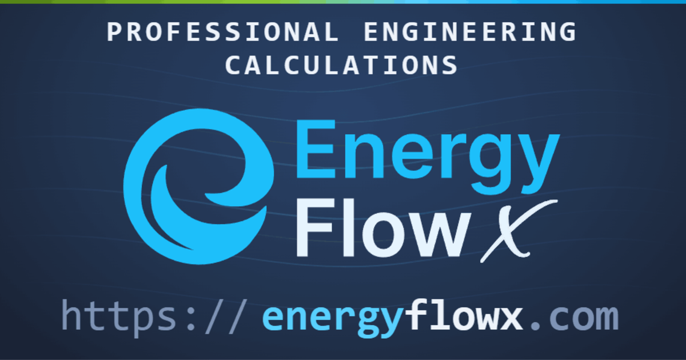
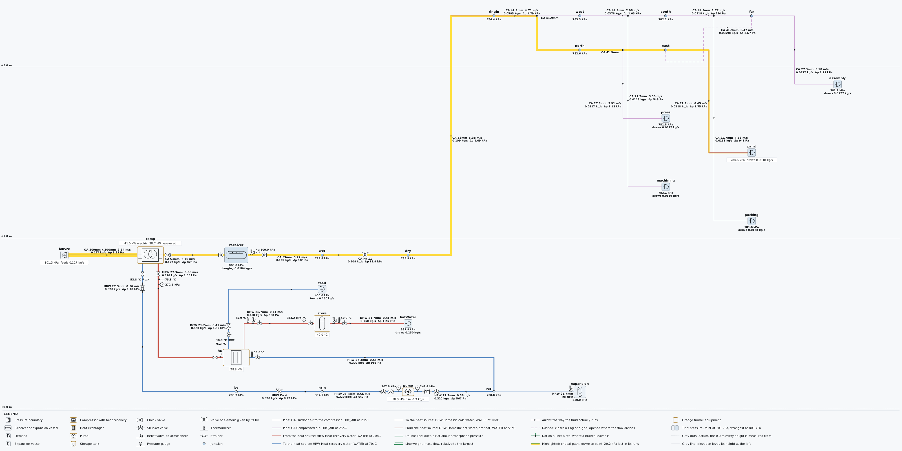

[](https://energyflowx.com)

<h1 align="center">EnergyFlowX for Claude</h1>

<p align="center">
  <strong>Validated engineering physics inside your AI assistant.</strong><br>
  Fluid properties, psychrometrics, air handling, pipe and duct sizing and full hydraulic network solving,<br>
  computed from reference equations of state rather than guessed by a language model.
</p>

<p align="center">
  <a href="https://energyflowx.com"></a>
  <a href="https://energyflowx.com/mcp-server"></a>
  <a href="https://energyflowx.com/knowledge"></a>
  <a href="LICENSE"></a>
</p>

---

Ask a chatbot for the density of 30 % propylene glycol at 5 °C and you get a confident number from
nowhere. Ask it with this plugin installed and the number comes from the same engine that powers
[energyflowx.com](https://energyflowx.com), **with the method and its validity range attached**.

Two things follow from that:

- **Computed, not generated.** Every figure comes from the engine's equations, not from what the
  model thinks the answer should be. The same question gives the same answer every time.
- **You do not need a frontier model.** The largest models can often work a calculation out on
  their own. With the engine behind it, an assistant only states the inputs and reads back the
  result, so a smaller, faster and cheaper model gets the same figures as the biggest one. The
  quality of your numbers does not depend on which model or which vendor you use.

This repository is the official, maintained Claude plugin for the EnergyFlowX MCP service. It does two
things at once:

1. **Connects the EnergyFlowX members server**, every tool behind one sign-in to your account, so
   Claude can call the calculation tools and you never handle an API key.
2. **Adds four skills** that teach Claude how to use them well: which inputs matter, what to check
   before quoting a result, and how to present it so an engineer can verify it. Each skill can also be
   [downloaded on its own](#install-a-single-skill) for an assistant that reads skills but not plugins.

Want the full picture of EnergyFlowX, beyond this plugin? The web platform, its physics, its
validation evidence and every reference behind it are documented in
**[github.com/pjazdzyk/energy-flow-x-docu](https://github.com/pjazdzyk/energy-flow-x-docu)**.

## Contents

- [What it can do](#what-it-can-do), and [every capability in detail](CAPABILITIES.md)
- [Where it fits](#where-it-fits)
- [Quick start](#quick-start)
- [Try it](#try-it)
- [What is inside](#what-is-inside)
- [Your account: sign in, or an API key](#the-api-key)
- [Other clients: Claude Desktop, Gemini CLI, Codex, ChatGPT, Cursor, VS Code](#other-clients)
- [Install a single skill](#install-a-single-skill)
- [Update, disable, uninstall](#update-disable-uninstall)
- [Troubleshooting](#troubleshooting)
- [What the plugin sends, and where](#data-and-privacy)
- [Access terms](#access-terms)
- [Links](#links)
- [Licence](#licence)

## What it can do

Sixteen tools, all on the members server the plugin connects, grouped here by the question they answer.
Eleven of them are also on the free server, which needs no account (see [Other clients](#other-clients)).
[CAPABILITIES.md](CAPABILITIES.md) lists every fluid, block, rule set, fitting and limit in detail.

### Fluid and material properties

Any property at any valid state, from the reference equation of state for that fluid, with the
method and its validity range stated in every answer. Sweeps over up to 20 states in one call through the
plugin (5 on the free server).

| Family | Fluids | Method | On the free server too |
| --- | --- | --- | --- |
| Water and steam | liquid water, steam (from any two of p, T, h, s, x) | IAPWS-IF97 | yes |
| Air | dry air, humid air (six input pairs, from RH, humidity ratio, wet bulb, dew point and enthalpy), with its full psychrometric state | Lemmon reference EOS, psychrometrics | yes |
| Industrial gases | hydrogen, CO₂, ammonia, propane, nitrogen, oxygen, argon, helium, methane, N₂O | multiparameter Helmholtz EOS | yes |
| Natural gas | presets or your own composition, plus calorific value and Wobbe index at six reference conditions, and flammability limits | GERG-2008 (ISO 20765-2), ISO 6976 | yes |
| Glycols | ethylene glycol, propylene glycol | Melinder correlations | yes |
| Refrigerants | R134a, R1234ze, R1234yf, R32, R125, R454B, R410A, R407C | multiparameter Helmholtz EOS | no, members server |
| Brines | calcium chloride, ethanol, methanol, potassium formate solutions | Melinder correlations | no, members server |
| Solids | ice, with enthalpy on both datums | IAPWS-06 | yes |

Also saturation (boiling point at a pressure and the reverse, phase densities, latent heat, critical
and triple points) and unit conversion.

### Pipe and duct sizing

- Velocity, pressure drop, Reynolds number, friction factor and flow regime for one pipe or duct.
- **Size selection** against design criteria or your own limits: the smallest size that passes, the
  size below and the limit it breaks, and the size above.
- Real product catalogues: inner bore, wall thickness, SDR and roughness for standard pipes and
  ducts.
- Schedules of up to 20 segments with fittings, judged against a total pressure-drop budget.
- A heat load in place of a flow, for water, glycols, brines and air.

### Air handling (AHU processes)

Heating and cooling coils with condensate and water flow, mixing up to six streams, heat recovery to
EN 16798-3 and EN 308 with frost protection, fans and the heat they add, steam humidification
(any steam state and target, members server), air-water contact, dehumidification and desiccant wheels. One block or a chain of up to eight. A
target a step cannot reach is reported as not feasible, never as a clean answer.

### Hydronic: complex hydraulics (members server)

Whole pipe and duct networks built step by step on the server: pressure boundaries, demands, pipes,
fittings and resistances, branched or looped. Water and glycol circuits, compressed air, natural gas,
ventilation ducts, steam mains and refrigerant lines, and several fluids in one design, each solved at
its own temperature. The solver finds every flow and pressure at once, reports velocities (with the
Mach number for a gas) and any node where the fluid condenses, flashes or boils, then says what to
check before trusting the numbers. Pumps, compressors with heat recovery, heaters, heat exchangers,
storage tanks and receivers are devices (a pump on a liquid only), and a design runs over time too, with
schedules, pressure or flow switches and PI loops: receiver swings, compressor starts, how long the air lasts after a trip, how far a store
charges. There are no control valves, balancing, fans or water hammer yet. Before any solve,
`hydronic_preview` draws the design the way the engine read it, in the same symbols the report uses, and says
in words how many separate pieces and closed loops it has and where a branch ends nowhere. Your assistant
can set that beside your sketch or a photo of your schematic and catch a wrong connection before it is
solved. After the solve, `hydronic_report` turns the
result into a **self-contained HTML study** with a network diagram drawn in P&ID symbols and labelled
with flows and pressures, schedules and the checks, ready to hand to a colleague, and the same diagram as
a **DXF** to open in CAD. The server makes it, and the chat shows the diagram as soon as it returns.

#### What a report looks like

[](https://energyflowx.com/case-studies/compressed-air-plant/study.html)

The question, as it was asked: *a 41 kW compressor delivering 6.4 m³/min of free air through a ducted intake
charges a 6 m³ receiver on a pressure switch at 7.5 and 9 bar absolute, and through a dryer feeds a 210 m ring
with five work areas drawing 5.5 m³/min. Its oil cooler gives 72 % of the input to a closed water loop that
preheats mains water through a plate heat exchanger. Does every tool keep its 6 bar, how does the compressor
cycle, and how much heat reaches the hot water?* The answer came back as the drawing above, the full
[study page](https://energyflowx.com/case-studies/compressed-air-plant/study.html) and a DXF:

- At the design point, the receiver at its 8 bar, 20.2 kPa is lost on the way to the farthest tool, 13.9 kPa of
  it in the dryer.
- Over the run the paint shop's lowest is 6.23 bar gauge, at the bottom of the receiver's swing, above the 6 bar
  its tools need.
- The ring is fed both ways, and the flows meet where the run between two corners carries only 0.006 kg/s.
- The compressor unloads twice in 20 minutes and runs loaded 83 % of the time at 36.2 kW on average.
- 25.4 kW recovered from the oil cooler, sending mains water to the store at about 56 °C. The run's energy
  balance closes: of the 8.48 kWh recovered, 1.99 kWh stay in the store and 6.49 kWh leave with the hot water.

The study comes in two parts, so no figure is of a state the reader cannot name: the design point, solved steady,
which the drawing and every schedule show, and the run over time, with each machine over the run, the lowest
pressure every point saw and when, its curves, and a mass and energy balance that says whether the run closes.

The drawing is generated from the design, deterministically: the same design always gives the same drawing,
and no AI draws it. Five systems sit on it, each line carrying its code: OA outdoor air in a duct (the double
line), CA compressed air, HRW heat recovery water, DCW domestic cold water and DHW domestic hot water, all
solved together in one design: the compressor joins the air to the water, and the exchanger joins the loop to
the potable water. Water
leaving a heat source is red and water going to it blue, every gauge and thermometer shows what it reads, and
the highlighted route is the critical path. The worked example is also on
[energyflowx.com/hydronic](https://energyflowx.com/hydronic).

> **Illustrative only.** This plant is an example made to show what the server computes, not a real design.
> Its diagram is not a complete P&ID: fittings, equipment and the control and safety components a built plant
> needs are left out or simplified.

**Size limit.** One design holds up to 2,000 nodes and pipes together, which covers a building, a plant
room, a campus loop or a district branch. A whole city network does not fit in one design: it is split
into parts joined at pressure boundaries, and each part is solved on its own. An exported design near
the limit is about 250,000 characters, so keep it as a file. These limits apply to free use and may be
lowered at any time to match server capacity.

## Where it fits

**Use it for:**

- **HVAC and MEP design**: coil duties, supply conditions, condensate, heat recovery, pipe and duct
  sizes, and the flows and pressures of whole heating, cooling, ventilation, compressed-air, gas and
  steam networks.
- **Process and energy engineering**: steam, industrial gases, natural gas calorific value, secondary
  coolants and refrigerant properties.
- **Checking a number** someone has quoted: a supply temperature, a pressure drop, a property from an
  old table.
- **Teaching and learning**: every result names the method and the standard behind it, so it can be
  looked up and defended.

**It is not:**

- A replacement for a qualified engineer. It computes, you decide.
- A building energy simulation, a CFD tool or a load calculation. It answers questions about fluids,
  conduits, air processes and pipe networks, steady or over time, but not pressure waves.
- A guess. When an input is out of range or a target cannot be met, it says so instead of returning
  a plausible number.

## Quick start

Inside Claude Code, run:

```shell
/plugin marketplace add pjazdzyk/energy-flow-x-mcp
/plugin install energyflowx@energyflowx
```

Or from a terminal:

```shell
claude plugin marketplace add pjazdzyk/energy-flow-x-mcp
claude plugin install energyflowx@energyflowx
```

Restart Claude Code and run `/mcp`. You should see one server:

| Server | Endpoint | Account |
| --- | --- | --- |
| `energy-flow-x` | `https://energyflowx.com/energy-flow-x/mcp/members` | your free EnergyFlowX account: sign in from `/mcp` |

Pick it and choose **Authenticate**. Your browser opens energyflowx.com, you sign in and approve, and
every tool works from then on: fluids, refrigerants and brines included, sizing, air handling, the
steam humidifier and network solving. The plugin stores no key and asks for none
([Your account](#the-api-key)). The account is free. If you would rather not create one, connect the
free server yourself instead ([Other clients](#other-clients)).

## Try it

Paste any of these into Claude Code after installing:

**Fluid properties**

> What are the density, specific heat and viscosity of 35 % ethylene glycol at -10 °C?

> Saturation temperature of water at 3 bar, and the latent heat there.

> Humid air at 26 °C and 55 % RH at 97.8 kPa (about 300 m above sea level): density, enthalpy, dew
> point and humidity ratio.

> R32 at 40 °C: saturation pressure, liquid and vapour density, latent heat.

**Pipe and duct sizing**

> Which steel pipe size for 2.4 kg/s of water at 70 °C, keeping below 150 Pa/m? Show me the size
> below and why it fails.

> Size a galvanised rectangular duct for 3,000 m³/h at no more than 4 m/s and an aspect ratio of at
> most 4. The ceiling void allows 350 mm.

**Air handling**

> Mix 2,000 m³/h of outdoor air at -5 °C / 80 % RH with 6,000 m³/h of return air at 22 °C / 40 %,
> then heat it to 20 °C. What is the coil duty?

> Cooling coil: 30 °C / 50 % RH in, 13 °C off-coil. Duty, condensate rate and chilled-water flow at
> 7/12 °C.

**Hydronic** (members server)

> A plant room at 3 bar feeds a heating riser in 35 mm copper at 70 °C, with three floors 3.5 m apart
> each drawing 0.25 kg/s. Solve it: what pressure reaches the top floor, and which run costs the most?

> Produce an HTML report of that network with a diagram and schedules.

> A workshop compressed-air ring in 53 mm steel off a receiver at 8 bar absolute, four consumers rated
> in free air delivery and a filter with a Kv of 60. Which tool sees the lowest pressure, and is any run
> too fast?

## What is inside

| Skill | What it covers | Tools | Account |
| --- | --- | --- | --- |
| [`fluid-properties`](skills/fluid-properties/SKILL.md) | 29 fluids and solids: water and steam, humid air, glycols, brines, refrigerants, industrial gases, natural gas (GERG-2008, ISO 6976), ice, unit conversion | 6 | refrigerants and brines only |
| [`conduit-sizing`](skills/conduit-sizing/SKILL.md) | one pipe or duct against real catalogues: velocity, pressure drop, regime, the size below and above | 4 | not needed |
| [`hvac-processes`](skills/hvac-processes/SKILL.md) | coils with condensate, mixing, heat recovery (EN 16798-3, EN 308), fans, humidification, dehumidification, desiccant wheels | 1 | the steam humidifier only |
| [`hydronic`](skills/hydronic/SKILL.md) | whole pipe and duct networks of liquids, gases and steam, several fluids in one design, with pumps, compressors, heat exchangers, stores and receivers, steady or over time: build, solve, check, and report it as an HTML study with a P&ID-symbol network diagram, tables and a DXF of the drawing | 5 + 10 resources | required |

Every free tool is read-only and idempotent, so Claude does not stop to ask
permission for a lookup. Two network tools change a session you own, and say so, and `hydronic_report` keeps a
new report on every call, so it is not read-only either.
Inputs carry their own units (`"20oC"`, `"1.5bar"`, `"70degF"`, `"8g/kg"`), and every response names
the unit it produced.

<a id="the-api-key"></a>
## Your account: sign in, or an API key

The account is free, and with the plugin it is the only thing you need. Sign in once and every tool
works, the members-only ones included:

| What needs the account | Why |
| --- | --- |
| **Refrigerants**: R134a, R1234ze, R1234yf, R32, R125, R454B, R410A, R407C | members-only fluids |
| **Brines**: calcium chloride, ethanol, methanol, potassium formate solutions | members-only fluids |
| **Steam humidifier**: the `STEAM_HUMIDIFIER` block of `calculate_air_process` | members-only process |
| **Hydronic**: all six hydronic tools | a network session needs an owner |
| **Larger sweeps**: up to 20 states per call instead of 5 | anonymous calls are capped |

**Sign in.** Create a free account at
[energyflowx.com/registration](https://energyflowx.com/registration). Then run `/mcp` in Claude Code,
choose `energy-flow-x` and **Authenticate**. Your browser opens energyflowx.com: sign in if asked,
check that the page names Claude Code and your account, and approve. Claude Code keeps the connection
and renews it on its own, so the plugin holds no credential and asks for none. On claude.ai and in
Cowork the same server shows a **Connect** button that does the same. Every connected app is listed
under [Settings](https://energyflowx.com/settings), **Connected apps**, where you can disconnect it.
It then has to ask you again.

**API keys are for assistants that cannot sign in**, such as a script or a local model, never for the
plugin. Create one under [Settings](https://energyflowx.com/settings), **API keys** (it starts with
`efxk_`), and send it as an `Authorization: Bearer efxk_...` header to the members server.

<a id="other-clients"></a>
## Other clients: Claude Desktop, Gemini CLI, Codex, ChatGPT, Cursor, VS Code

The skills are written for any assistant, and the servers work with any MCP client. There are two,
and you connect **one** of them: the members server already carries every free tool, so with both
connected each free tool appears twice.

| Server | Address | Account | Tools |
| --- | --- | --- | --- |
| Free | `https://energyflowx.com/energy-flow-x/mcp/free` | none | the 11 property, sizing and air tools, without the members-only fluids and the steam humidifier |
| Members | `https://energyflowx.com/energy-flow-x/mcp/members` | sign in, or an API key | all 16 tools |

The exact, current snippets for each client are on
[energyflowx.com/mcp-server](https://energyflowx.com/mcp-server). The short version:

**Claude Code without the plugin**

```shell
claude mcp add --transport http energy-flow-x https://energyflowx.com/energy-flow-x/mcp/members
```

Then `/mcp`, choose it and **Authenticate**. Use the `/mcp/free` address instead for no account.

**claude.ai, Claude Desktop, Cowork**: Settings → Connectors → Add custom connector, paste the
members address and press **Connect** to sign in, or paste the free address, which needs no sign-in.

**Gemini CLI**: this repository is also a Gemini CLI extension, the members server and the four skills:

```shell
gemini extensions install https://github.com/pjazdzyk/energy-flow-x-mcp
```

Restart Gemini CLI and run `/mcp auth energy-flow-x` to sign in. Gemini CLI starts MCP servers only in a
folder you trust, so if `/mcp` lists the server as disabled, trust the folder when Gemini asks, or with
`/permissions`.

**Codex**: this repository is also an OpenAI plugin, the members server and the four skills:

```shell
codex plugin marketplace add pjazdzyk/energy-flow-x-mcp
codex plugin add energyflowx@energyflowx
```

Then `codex mcp login energy-flow-x` to sign in. In ChatGPT, a plugin that is not in its directory is
added under Plugins, **+**, **Upload plugin**, from the `energyflowx-openai-*.zip` attached to the
[latest release](https://github.com/pjazdzyk/energy-flow-x-mcp/releases/latest).

**Cursor** (`.cursor/mcp.json`):

```json
{
  "mcpServers": {
    "energy-flow-x": {
      "url": "https://energyflowx.com/energy-flow-x/mcp/members"
    }
  }
}
```

**VS Code** with GitHub Copilot agent mode (`.vscode/mcp.json`, note the key is `servers`):

```json
{
  "servers": {
    "energy-flow-x": {
      "type": "http",
      "url": "https://energyflowx.com/energy-flow-x/mcp/members"
    }
  }
}
```

A client that supports MCP sign-in (OAuth) opens energyflowx.com to connect your account. For one
that does not, send an API key as an `Authorization: Bearer efxk_...` header.

## Install a single skill

Each folder under [`skills/`](skills/) is a self-contained [Agent Skill](https://agentskills.io), so an
assistant that reads skills but not plugins can take only the one it needs. Every release carries a
zip per skill:

| Skill | Download |
| --- | --- |
| `fluid-properties` | [fluid-properties.zip](https://github.com/pjazdzyk/energy-flow-x-mcp/releases/latest/download/fluid-properties.zip) |
| `conduit-sizing` | [conduit-sizing.zip](https://github.com/pjazdzyk/energy-flow-x-mcp/releases/latest/download/conduit-sizing.zip) |
| `hvac-processes` | [hvac-processes.zip](https://github.com/pjazdzyk/energy-flow-x-mcp/releases/latest/download/hvac-processes.zip) |
| `hydronic` | [hydronic.zip](https://github.com/pjazdzyk/energy-flow-x-mcp/releases/latest/download/hydronic.zip) |
| all four | [energyflowx-skills.zip](https://github.com/pjazdzyk/energy-flow-x-mcp/releases/latest/download/energyflowx-skills.zip) |

- **claude.ai, Claude Desktop, Cowork**: upload the zip in the Skills section of your settings.
- **Claude Code**: unzip it into your skills directory, for example `~/.claude/skills/`.
- **Another assistant that reads Agent Skills**: unzip it where that assistant looks for skills.

A skill on its own does not connect a server, so add one as shown in
[Other clients](#other-clients).

## Update, disable, uninstall

```shell
claude plugin marketplace update energyflowx    # fetch the latest version
claude plugin update energyflowx@energyflowx    # apply it (restart Claude Code)
claude plugin disable energyflowx@energyflowx   # keep it installed, switch it off
claude plugin uninstall energyflowx@energyflowx # remove it
```

## Troubleshooting

**The server shows as failed in `/mcp`.** Check you can reach
[energyflowx.com](https://energyflowx.com) from that machine. Corporate proxies sometimes block
streaming HTTP.

**`energy-flow-x` shows as needing authentication.** That is expected until you sign in: run `/mcp`,
choose it and **Authenticate**. If it stops working after you disconnected it under Settings,
**Connected apps**, authenticate again the same way.

**A refrigerant, a brine or the steam humidifier is refused.** You are on the free server, which
needs no account and leaves those out. The refusal names the members server: connect that one and
sign in.

**Something is wrong with a number.** Tell us: see [Links](#links). Include the prompt, the inputs
and what you expected. Every result states its method, so quoting it helps.

<a id="data-and-privacy"></a>
## What the plugin sends, and where

The plugin runs nothing on install. It has no hooks, no executables and no package installs. It
connects one remote MCP server on `energyflowx.com`, over HTTPS:

- **`energy-flow-x`**, the members server, receives the arguments of each tool call (fluid states,
  conduit and flow data, air-process inputs, the network design you build and the calls that edit,
  solve, inspect and report it), plus the access token Claude Code received when you signed in, in the
  `Authorization` header. The plugin itself holds no credential. A design lives in a server-side
  session owned by your account and expires after 24 hours. A report of it is kept at most 24 hours
  behind links that anyone holding them can open, and holds the design's figures and the names you gave
  it, nothing from your account.

The plugin runs no code on your machine: every calculation, and every report, is made on the server.
It sends nothing to any other destination. How the service treats this data is set out in the
[privacy policy](https://energyflowx.com/legal/privacy-policy) and the
[terms of use](https://energyflowx.com/legal/terms-of-use).

## Access terms

The eleven tools on the free server are free today and need no account. **The Hydronic network
tools are free for testing and move to a paid plan in 2027.** Solving networks costs real compute,
and until then the free access can be limited, metered or withdrawn at any time and without notice.
Build on it by all means, but do not plan around it staying free.

## Links

| | |
| --- | --- |
| Website | [energyflowx.com](https://energyflowx.com) |
| MCP server and client setup | [energyflowx.com/mcp-server](https://energyflowx.com/mcp-server) |
| Knowledge base, the physics behind every tool | [energyflowx.com/knowledge](https://energyflowx.com/knowledge) |
| Everything about EnergyFlowX: features, physics, validation evidence, references | [github.com/pjazdzyk/energy-flow-x-docu](https://github.com/pjazdzyk/energy-flow-x-docu) |
| Contact and community | [energyflowx.com/misc/social](https://energyflowx.com/misc/social) |

## For maintainers

```bash
python tests/check_skills.py                                             # the skills against the server's own docs
python ../energy-flow-x-iac/scripts/package-plugin-skills.py            # the skill zips, attach them to every release
claude plugin validate . --strict                                        # the marketplace manifest
claude plugin validate .claude-plugin/plugin.json --strict               # the plugin manifest and its .mcp.json
```

The repository root is both the plugin and its one-entry marketplace, so the root is also the folder
submitted to Anthropic's plugin directory.

Gemini CLI installs the source of the newest GitHub release, not `master`. So every version is
released, with the skill zips and the OpenAI zip attached: a release that lacks them or carries exactly one asset, or an asset
named for a platform (`win32.`, `linux.`, `darwin.`), makes Gemini CLI install that asset instead of the
extension.

## Licence

Proprietary. See [LICENSE](LICENSE).

In short: **install it and use it freely**, personally, inside your organisation, or on client work,
and modify a local copy to fit your setup. No registration, no attribution, no payment. What is not
granted is redistribution: republishing this plugin, in original or modified form, to any
marketplace or registry, presenting a fork as the official EnergyFlowX plugin, or adapting it to
front a different service.

This repository is client-side instructions only and calculates nothing. The EnergyFlowX engines and
the service behind them are separate proprietary software with their own terms. Much of the service
is free within published limits, some of it needs a free account, and the free tiers are granted at the
operator's discretion.

---

<p align="center">
  Built by <a href="https://energyflowx.com">Piotr Jazdzyk</a>, SYNERSET.<br>
  <sub>Engineering results are not a substitute for the judgement of a qualified engineer. Verify every result before relying on it.</sub>
</p>
